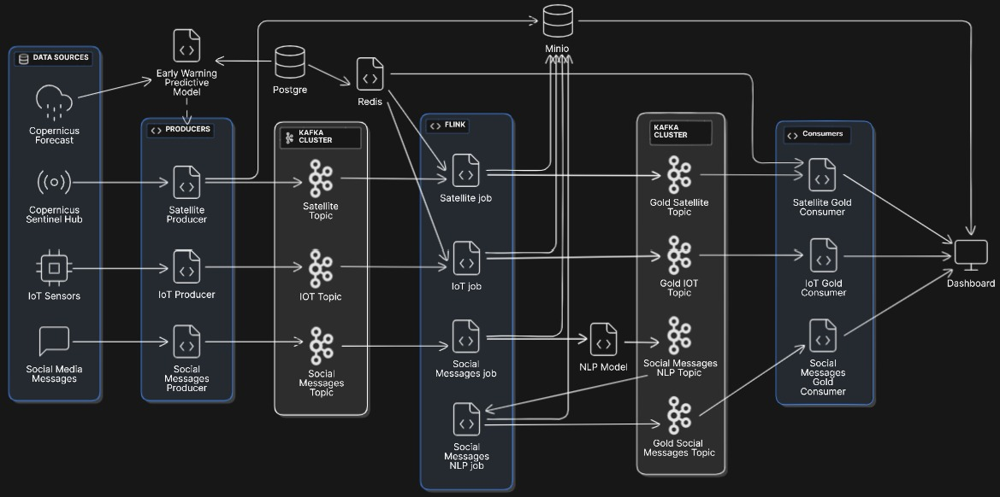
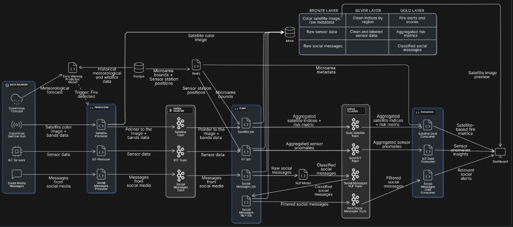

# Disaster Response Coordination System (DRCS)

## Overview
The Disaster Response Coordination System is a Big Data platform designed to support real-time emergency management by integrating data from diverse sources, including satellite imagery, IoT sensor streams, social media feeds, and official meteorological data.

The system leverages streaming technologies such as Apache Kafka for high-velocity data ingestion and Apache Flink for real-time processing and aggregation. Machine Learning models are employed to assess risk levels and detect potential hazards based on historical patterns and live data. All ingested data is organized within a multi-layer Data Lakehouse architecture (bronze, silver, gold), stored on MinIO for scalable and efficient access.

The final output powers an interactive dashboard for emergency response agencies, offering a unified view of remote sensing metrics, sensor anomalies, social signals, and actionable alerts—enabling fast and coordinated decision-making across a wide range of emergency scenarios.

--- 

## Contents

1. [Study Case: California Wildfires](#6-study-case-california-wildfires)
2. [Project Structure](#project-structure)  
3. [Getting Started](#getting-started)  
4. [System Architecture](#system-architecture)  
5. [Data Sources](#data-sources)  
6. [Dashboard Demo](#dashboard-demo)  
7. [Authors](#authors)

---

## 1. Case study: California Wildfires 

<p align="center">
  
</p>

While the system architecture, data ingestion mechanisms, and insight generation capabilities of the **Disaster Response Coordination System (DRCS)** are designed to be general-purpose and adaptable to any disaster scenario worldwide, a specific case study is necessary to demonstrate the system’s capabilities in action. 

### Selected Scenario 
For this simulation, the development team chose to model a real-life disaster scenario involving **wildfires in California**, a region that has historically and recently (as of June 7, 2025) suffered significant damage due to this type of natural hazard. 

To run the system on real geospatial data, a **GeoJSON file** defining the boundaries of the region to monitor must be provided. This file can be created and downloaded directly from the official [Copernicus Browser](https://browser.dataspace.copernicus.eu), which allows users to interactively define a custom region and export it in the required format. This file should be placed in the following directory of the project: 

``` ./setup_orchestrator/Macro_data/Macro_input/ ``` 

The DRCS system will automatically process this file, dividing the macroarea into a grid of **microareas**. This allows for parallel monitoring and ensures that each request to the Sentinel Hub API respects the size limits for satellite image retrieval. A default macroarea file is already provided in the appropriate folder, corresponding to a region in **California near Sacramento and Woodland**. You can preview this area by opening the JSON file, copying the coordinates, and visualizing them in the Copernicus Browser. 

### Scalability and Modularity
 The system's setup phase is **modular and extensible**: 
 
   - Additional macroareas can be added simply by including more GeoJSON files. 
   - Each macroarea is automatically partitioned into microareas based on spatial resolution and system constraints. 
   - Data partitioning, hashing, and storage mechanisms in the data lakehouse are fully compatible with multiple macroareas and timestamps. 

However, when it comes to **streaming**, performance constraints must be considered. Monitoring multiple microareas in real-time can become resource-intensive. For standard hardware (e.g., a machine with 8–16 GB RAM and 10–12 CPU cores), it is feasible but suboptimal to process many streams simultaneously. For this reason, the current simulation focuses on **a single microarea** within the chosen macroarea, which serves as a representative example. 

Scaling the system to monitor multiple microareas would require: 
   - Modifying the `docker-compose` setup to dynamically instantiate producers for each data source per microarea. - Increasing the number of Kafka brokers and Flink job managers/task managers. 
   - Running multiple dashboard instances—one per microarea—with distinct exposed ports. These modifications are achievable and the architecture is designed to support them with minor adjustments, but they require sufficient computational resources. 

### Execution Summary 
When launching the project, the study case executed will correspond to: 
   - A **hardcoded microarea** in California near **Sacramento (Woodland)**. 
   - **Satellite imagery** fetched every minute. 
   - **IoT sensor measurements** (e.g., temperature, humidity, air quality) generated every 5 seconds. 
   - **Simulated social media messages** ingested every second. 
   - **Early warning logic**, triggered at startup, based on historical weather data and upcoming forecasts from the Copernicus Climate Data Store. 

This scenario allows users to observe how the DRCS system performs in a realistic setting. The rest of the documentation focuses on the general architecture and design principles, which can be extended beyond this specific use case.

---

## 2. Project Structure
```
DRCS_1.0/
├── docker-compose.yml
├── docker-compose.early_warning.yml
├── entrypoint.sh
├── .gitignore
├── README.md
├── media/
│   ├── DRCS_logo.png
│   ├── SystemDesign.jpeg
│   └── DataFlow.jpeg
├── dashboard/
│   ├── Dockerfile
│   ├── dashboard.py
│   └── Utils/
├── early_warning_model/
│   ├── Dockerfile
│   ├── main.py
│   ├── requirements.txt
│   └── Utils/
├── img_producer/
│   ├── Dockerfile
│   ├── prod_img.py
│   ├── requirements.txt
│   ├── Config/
│   └── Utils/
├── iot_flink_job/
│   ├── Dockerfile
│   ├── main.py
│   └── data_templates.py
├── meteo_data/
│   ├── meteo_forecast.csv
│   └── meteo_totrain.csv
├── meteo_data_loader/
│   ├── Dockerfile
│   ├── data_loader.py
│   ├── requirements.txt
│   └── Utils/
├── msg_producer/
│   ├── Dockerfile
│   ├── prod_msg.py
│   ├── requirements.txt
│   └── Utils/
├── nlp_microservice/
│   ├── Dockerfile
│   ├── main.py
│   └── data_templates.py
├── satellite_flink_job/
│   ├── Dockerfile
│   ├── main.py
│   └── data_templates.py
├── sens_producer/
│   ├── Dockerfile
│   ├── prod_sens.py
│   ├── requirements.txt
│   └── Utils/
├── setup_minio/
│   └── create_minio_buckets.py
├── setup_orchestrator/
│   ├── Dockerfile
│   ├── orchestrator.py
│   ├── geo_grid_processor.py
│   ├── preload_redis.py
│   ├── requirements.txt
│   ├── Macro_data/
│   └── Utils/
├── social_flink_job/
│   ├── Dockerfile
│   ├── main.py
│   └── data_templates.py
```

The repository is organized into several key directories and files:

- **dashboard/**: Contains the interactive dashboard application used by emergency responders. Includes the main visualization script and utility functions, along with a dedicated Dockerfile for containerization.

- **early_warning_model/**: Hosts the predictive model that detects potential wildfire outbreaks using historical and weather data. Includes supporting utilities and dependencies.

- **img_producer/, msg_producer/, sens_producer/**: These components simulate or stream real-time data (satellite images, social media messages, sensor readings) into Kafka topics. Each includes utility functions, config files, and a Dockerfile.

- **iot_flink_job/, satellite_flink_job/, social_flink_job/**: Apache Flink jobs responsible for consuming, enriching, and processing IoT, satellite, and social media streams in real time.

- **meteo_data/**: Includes historical weather data with fire risk labels for model training (meteo_totrain) and forecasted data for making predictions (meteo_forecast). All files are in CSV format.

- **meteo_data_loader/**: A lightweight component for loading official weather forecast data into the system. Includes a Dockerfile and requirements.

- **nlp_microservice/**: Provides natural language processing capabilities for classifying and extracting signals from social media posts using TF-IDF vectorization. Includes data templates and a lightweight Flask/FastAPI service.

- **setup_minio/**: Includes scripts to initialize and configure MinIO buckets used as the storage backend for the Data Lakehouse (bronze, silver, gold layers).

- **setup_orchestrator/**: Coordinates geospatial grid preprocessing and prepares foundational data. Also handles stateful tasks like Redis preloading. Contains both scripts and macro data assets.

- **media/**: Visual assets including the system architecture diagram, dataflow schematic, and project logo.

**Root Files**:

**README.md**: Main documentation for the project.

**docker-compose.yml**: Defines and launches the multi-container environment, connecting all services (Kafka, Flink, MinIO, etc.).

**docker-compose.early_warning.yml**: A specialized configuration for testing the early warning pipeline.

**entrypoint.sh**: A shell script used to bootstrap the environment or services.

**.gitignore**: Specifies intentionally untracked files to ignore in Git.

---

## 3. Getting Started

1. **Clone the Repository**:
   ```bash
   git clone https://github.com/BDT-Team3/DRCS_1.0.git
   cd DRCS_1.0

2. **JARs**:
Install the JARS necessary to run the Flink's job, and put them inside their directories.
- Flink Kafka Connector:
   ```bash
   https://repo1.maven.org/maven2/org/apache/flink/flink-connector-kafka/1.17.0/flink-connector-kafka-1.17.0.jar
   ```
- Kafka Clients
   ```bash
   https://repo1.maven.org/maven2/org/apache/kafka/kafka-clients/3.3.2/kafka-clients-3.3.2.jar
   ```

3. **SentinelHub Configuration (REQUIRED)**:
Before running image acquisition containers, you must **configure your SentinelHub credentials** in a `config.toml` file. This file is used by the `sentinelhub-py` library to authenticate requests:

- Go in the Config folder of the image producers containers (e.g. img_producer) and make sure to replace placeholders in `config.toml` with your own `client_id` and `client_secret`.  
- These are obtained by registering your app at:  
👉 [https://dataspace.copernicus.eu](https://dataspace.copernicus.eu)
- **After** loggin in, go to your personal area (top right widget 👤-> third option: sentinel hub). Go to 'User setting' and in the bottom-right area a OAuth clients section can be seen. Create your own access keys. 
- An example of a configuration file .toml ready to use is provided inside the image producers containers.
- For detailed help, refer to the official setup guide:  
🔗 [sentinelhub-py configuration](https://sentinelhub-py.readthedocs.io/en/latest/configure.html)

```toml
[default]
sh_client_id = "your-client-id"
sh_client_secret = "your-client-secret"
sh_base_url = "https://sh.dataspace.copernicus.eu"
sh_token_url = "https://identity.dataspace.copernicus.eu/auth/realms/CDSE/protocol/openid-connect/token"
```

4. **(Optional) Apple Silicon Arm64 CPU architecture**:
If you have an M1, M2... processor Apple Silicon you need to run this command before launching the system 
   ```bash
   export DOCKER_DEFAULT_PLATFORM=linux/amd64
   ```

4. **Run the application**:
Be sure the docker engine is working, then run 
   ```bash
   bash chmod +x entrypoint.sh
   bash ./entrypoint.sh
   ```

5. **Wait**: 
Wait for the early warning system to execute disaster probability forecast and trigger the live-streaming disaster response and coordination system. When the building of the containers is executed and the logs start to get printed you can directly head to the next phase.

6. **Access the data warehouse**: 
   Go to http://127.0.0.1:9001 and acccess with credentials:
   - ID: 'minioadmin'
   - Password: 'minioadmin'

7. **Access the dashboard**:
   Go to http://localhost:8501 and explore the monitoring system for the microarea example

---

## 4. System Architecture

The development of the Disaster Response Coordination System (DRCS) is driven by a modular architecture that combines streaming, analytics, storage, and alerting components. A carefully selected suite of big data technologies ensures that the system can manage high-velocity, multi-source data and deliver timely, actionable insights during disaster scenarios.

<p align="center">  </p>

Each component of the architecture plays a distinct role: Kafka handles real-time data ingestion, Flink processes and enriches data streams, predictive models detect anomalies, and the Lakehouse architecture stores and structures the data across bronze, silver, and gold layers.

The complete data flow, from raw input to actionable dashboard alerts, is illustrated below:

<p align="center">  </p>

This architecture enables the DRCS to operate in real time, providing emergency responders with a comprehensive and dynamic view of evolving disasters, grounded in multi-source intelligence.

---

## 5. Data Sources
The Disaster Response Coordination System (DRCS) integrates data from multiple sources to provide comprehensive situational awareness during disaster events. The primary data sources include:

**Satellite Imagery**: DRCS utilizes real satellite imagery obtained through the Sentinel Hub APIs, part of the Copernicus Data Space Ecosystem. This platform provides access to high-resolution optical and radar data from the Sentinel missions, enabling real-time monitoring of environmental conditions such as vegetation health, land cover changes, and thermal anomalies. The imagery is processed using Sentinel Hub's suite of RESTful APIs, including the Process API for image generation and the Catalogue API for data discovery. 

**Meteorological data**: Meteorological data includes both historical and forecasted weather variables essential for fire risk prediction. Historical data combines atmospheric and environmental indicators with recorded fire events, serving as labeled input for model training. Forecasted weather data is retrieved from the Copernicus Climate Data Store (CDS) via its API. Variables such as temperature, wind speed, humidity, and soil moisture are used by the model to assess the likelihood of wildfires and support early warning and emergency response efforts.

**IoT Sensor Data**: Due to the limited availability of open-access, real-time IoT sensor data globally, DRCS employs synthetic data generation to simulate ground-based sensor measurements. These synthetic datasets are designed to mimic realistic sensor outputs, including metrics such as temperature, humidity, and air quality indices. The simulated data streams are structured to reflect plausible scenarios and are instrumental in testing and validating the system's data ingestion and processing capabilities. For a detailed methodology on the synthetic data generation process, please refer to the accompanying report.pdf.

**Social Media Data**: To emulate the influx of information from social media during disaster events, DRCS incorporates synthetically generated textual data that mirrors common patterns and content found in real social media posts. These synthetic messages are crafted to represent various public reactions and reports related to disaster scenarios, providing a testbed for the system's natural language processing and sentiment analysis modules. This approach enables the evaluation of DRCS's capability to extract actionable insights from unstructured text data in the absence of access to live social media feeds.

---

## 6. Dashboard Demo
The DRCS dashboard is designed to support emergency response teams with real-time, data-driven insights. It provides an interactive interface to monitor ongoing disaster events, assess affected areas, and prioritize intervention efforts.

Navigate through the dashboard using the tabs to explore different live data streams and analytics tools:

- Sensor Monitoring: View real-time environmental measurements from simulated ground IoT stations.

- Satellite Insights: Inspect the latest satellite imagery and anomaly detections from the Copernicus Sentinel Hub.

- Social Media Signals: Analyze alerts from synthetically generated social media feeds that simulate real-world user reports.

- Severity Score Computations: Access model-generated severity scores that quantify the potential danger level of a detected disaster, helping prioritize response actions.

- Geospatial Visualization: Identify affected zones and overlay multiple data layers.

The dashboard enables emergency responders to make fast, informed decisions, visualizing streaming data in an intuitive platform.

---

## 7. Authors

- [Biasioli Gino](https://github.com/GinoBiasioli)
- [Miglioranza Ettore](https://github.com/ettoremiglioranza1012)
- [Tommaso Cestari](https://github.com/Tom28901)

---

### Useful Commands

```bash
# View logs of producers
docker-compose logs -f img_producer
docker-compose logs -f sens_producer
docker-compose logs -f msg_producer
docker-compose logs -f minio
docker-compose logs -f dashboard

```

